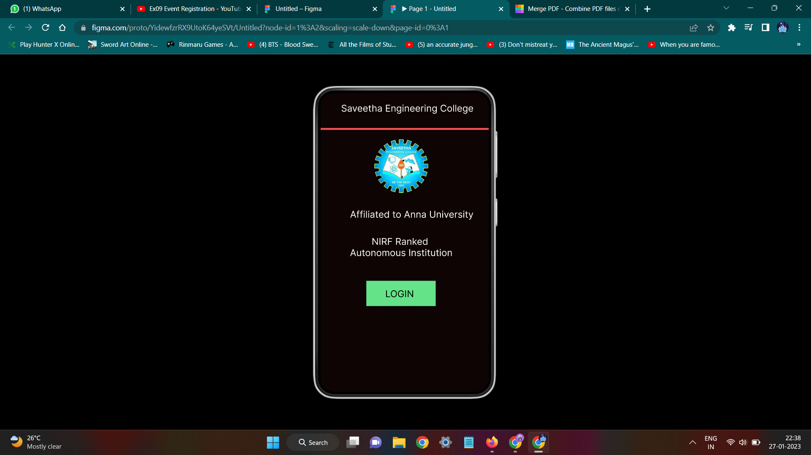
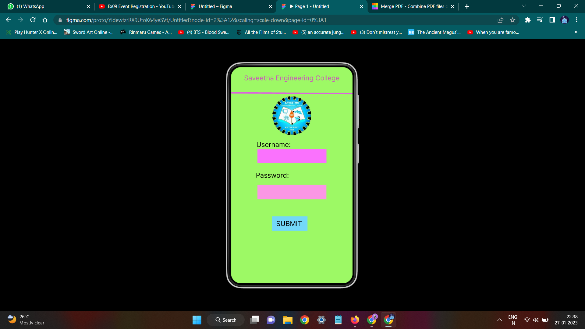
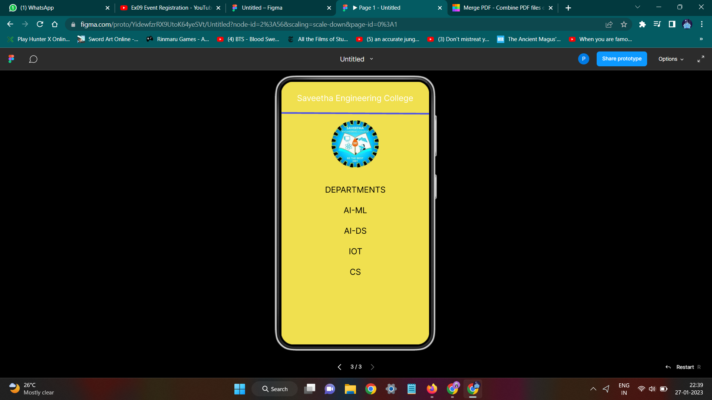

# Event Registration Web Application

## AIM:
To design, develop and deploy a web application for event registration.

## DESIGN STEPS:

### Step 1:
Create a new frame.

### Step 2:
Select any one preset size of your choice.

### Step 3:
Select the shapes you need.

### Step 4:
Import images as needed.

### Step 5:
Create pages based on your need and link them.

### Step 6:

Validate the HTML and CSS code.

### Step 6:

Publish the website in the given URL.

## DESIGN TOOL:
Figma

## Code:

```
/* Line 1 */
position: absolute;
width: 360px;
height: 0px;
left: 0px;
top: 79px;
border: 4px solid #F75252;


/* logo */
position: absolute;
width: 115px;
height: 115px;
left: 115px;
top: 99px;
background: url(0292a87a-5748-4989-a63c-18babc857332.jpg);
border-radius: 83.5px;


/* Affiliated to Anna University */
position: absolute;
width: 264px;
height: 24px;
left: 63px;
top: 248px;
font-family: 'Inter';
font-style: normal;
font-weight: 400;
font-size: 20px;
line-height: 24px;
text-align: center;
color: #FFFFFF;


/* NIRF Ranked Autonomous Institution */
position: absolute;
width: 219px;
height: 48px;
left: 63px;
top: 306px;
font-family: 'Inter';
font-style: normal;
font-weight: 400;
font-size: 20px;
line-height: 24px;
text-align: center;
color: #FFFFFF;


/* Rectangle 1 */
position: absolute;
width: 148px;
height: 54px;
left: 98px;
top: 402px;
background: #65E388;
box-shadow: 0px 4px 4px rgba(0, 0, 0, 0.25), 0px 4px 4px rgba(0, 0, 0, 0.25);


/* LOGIN */
position: absolute;
width: 122px;
height: 19px;
left: 108px;
top: 418px;
font-family: 'Inter';
font-style: normal;
font-weight: 400;
font-size: 20px;
line-height: 24px;
text-align: center;
color: #000000;


/* Saveetha Engineering College */
position: absolute;
width: 283px;
height: 24px;
left: 44px;
top: 21px;
font-family: 'Inter';
font-style: normal;
font-weight: 400;
font-size: 20px;
line-height: 24px;
text-align: center;
color: #FFFFFF;


/* Saveetha Engineering College */
position: absolute;
width: 283px;
height: 26px;
left: 38px;
top: 20px;
font-family: 'Inter';
font-style: normal;
font-weight: 400;
font-size: 20px;
line-height: 24px;
text-align: center;
color: #CB5BB9;


/* Line 3 */
position: absolute;
width: 360.01px;
height: 0px;
left: 0px;
top: 78px;
border: 4px solid #DC64DE;
transform: rotate(0.31deg);


/* logo */
position: absolute;
width: 115px;
height: 115px;
left: 122px;
top: 86px;
background: url(0292a87a-5748-4989-a63c-18babc857332.jpg);
border-radius: 83.5px;


/* Rectangle 2 */
position: absolute;
width: 204px;
height: 243px;
left: 78px;
top: 241px;

background: #FA72FD;


/* SUBMIT */
position: absolute;
width: 77px;
height: 48px;
left: 133px;
top: 451px;
font-family: 'Inter';
font-style: normal;
font-weight: 400;
font-size: 20px;
line-height: 24px;
text-align: center;
color: #000000;


/* Rectangle 3 */
position: absolute;
width: 204px;
height: 43px;
left: 78px;
top: 348px;
background: #FB97E5;


/* Username: */
position: absolute;
width: 109px;
height: 24px;
left: 71px;
top: 217px;
font-family: 'Inter';
font-style: normal;
font-weight: 400;
font-size: 20px;
line-height: 24px;
text-align: center;
color: #000000;


/* Password: */
position: absolute;
width: 98px;
height: 24px;
left: 73px;
top: 308px;
font-family: 'Inter';
font-style: normal;
font-weight: 400;
font-size: 20px;
line-height: 24px;
text-align: center;
color: #000000;


/* Saveetha Engineering College */
position: absolute;
width: 283px;
height: 24px;
left: 38px;
top: 28px;
font-family: 'Inter';
font-style: normal;
font-weight: 400;
font-size: 20px;
line-height: 24px;
text-align: center;
color: #FFFFFF;


/* Line 4 */
position: absolute;
width: 360.01px;
height: 0px;
left: 0px;
top: 78px;
border: 4px solid #5056E4;
transform: rotate(0.31deg);


/* logo */
position: absolute;
width: 115px;
height: 115px;
left: 122px;
top: 94px;
background: url(0292a87a-5748-4989-a63c-18babc857332.jpg);
border-radius: 83.5px;


/* DEPARTMENTS */
position: absolute;
width: 148px;
height: 24px;
left: 106px;
top: 251px;
font-family: 'Inter';
font-style: normal;
font-weight: 400;
font-size: 20px;
line-height: 24px;
text-align: center;
color: #000000;


/* AI-ML */
position: absolute;
width: 58px;
height: 24px;
left: 151px;
top: 301px;
font-family: 'Inter';
font-style: normal;
font-weight: 400;
font-size: 20px;
line-height: 24px;
text-align: center;

color: #000000;


/* AI-DS */
position: absolute;
width: 56px;
height: 24px;
left: 152px;
top: 351px;
font-family: 'Inter';
font-style: normal;
font-weight: 400;
font-size: 20px;
line-height: 24px;
text-align: center;
color: #000000;


/* IOT */
position: absolute;
width: 33px;
height: 24px;
left: 164px;
top: 401px;
font-family: 'Inter';
font-style: normal;
font-weight: 400;
font-size: 20px;
line-height: 24px;
text-align: center;
color: #000000;


/* CS */
position: absolute;
width: 28px;
height: 24px;
left: 166px;
top: 451px;
font-family: 'Inter';
font-style: normal;
font-weight: 400;
font-size: 20px;
line-height: 24px;
text-align: center;
color: #000000;

```


## OUTPUT:




## RESULT:
The program to design, develop and deploy a web application for event registration is completed successfully.